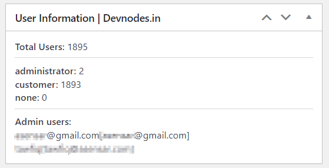
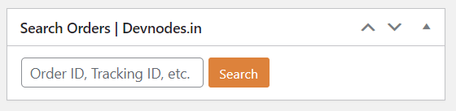

# Devnodes Dashboard Widget for Wordpress & Woocommerce

This is a simple plugin that provides a collection of useful widgets for WooCommerce stores.

## User Stats Widget

This widget that displays all users created in your WordPress/WooCommerce installation. It creates a widget in the WordPress dashboard that shows the total number of users, the number of users in each role, and a list of all users with the administrator role. This makes it easy to monitor the admin user list and check for any suspicious activity, such as role elevation or unauthorized access.

## Search Order Widget

Creates an admin dashboard widget that allows users to search for shop orders. This function can be used by shop admins who need to search for orders in their WooCommerce store. It is a quick and easy way to find orders by order ID, tracking ID, or other criteria.

## Contact Us

You can hire us to customize or add more feature to this plugin.

You can reach via [Devnodes.in](https://devnodes.in) or [https://github.com/thalib](https://github.com/thalib)
